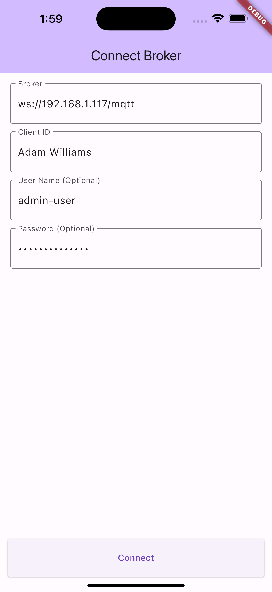
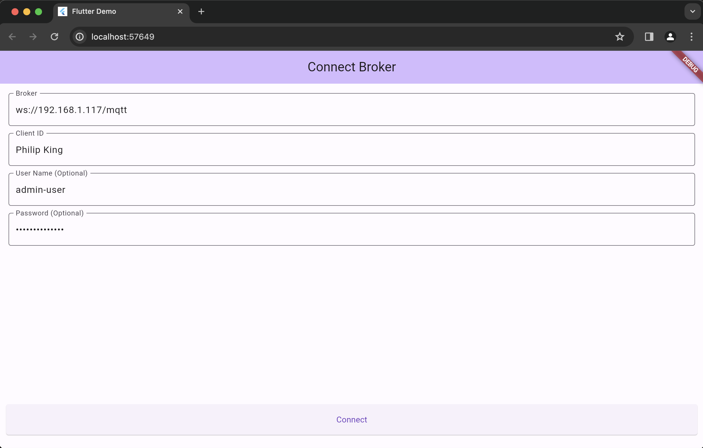

# flutter_mqqt_example_gui
A Flutter project to show examples of mqqt client.

Screenshot Android & Ios:

</img>

Screenshot Web:

</img>

### Built With

- [Flutter Sdk 3.19.3](https://storage.googleapis.com/flutter_infra_release/releases/stable/windows/flutter_windows_3.19.3-stable.zip) - Framework used.
  
 

**\* Supports Andorid, Ios and even Web.**

**\* To create your own MQTT Broker, navigate to [mqtt_docker_broker](https://github.com/YuLiangGoh/mqtt_docker_broker) for more information.**

## Authors

* **Zachary** - [YuLiangGoh](https://github.com/YuLiangGoh)

## License

This project is licensed under the MIT License - see the [LICENSE.md](LICENSE.md) file for details